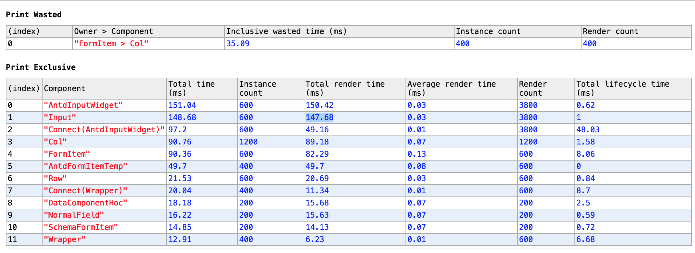

# react-schema-form

爬虫前端核心组件。

## react-schema-form-react V3

通过[json-schema](http://jsonschema.net/),[ui-schema](#custoization-ui-schema),自动生成表单组件。前后端可以复用一份JsonSchema来验证字段，错误消息前后端统一，这个可以有。

[一个完整的栗子](https://nick121212.github.io/fx-schema-form-react-demo/dist/index.html#/panel/create)

[点击这里查看demo](https://nick121212.github.io/fx-schema-form/packages/fx-schema-form-react/out/index.html)

> Note: 组件之间的功能组合使用hoc来实现。

## 目录

- [安装](#installation)
  - [npm](#installation-npm)
  - [cdn](#installation-cdn)
- [依赖项](#dependencies)
- [性能](#performance)
- [默认使用](#usage)
- [表单定制化](#custoization)
  - [uiSchema配置](#custoization-ui-schema)
  - [供选择的表单组件](#custoization-widget)
  - [模板](#custoization-temps)
  - [HOCS](#custoization-hocs)
  - [字段](#custoization-fields)
- [高级配置](#advanced-customization)
  - [自定义hoc](#advanced-customization-hoc)
  - [自定义字段](#advanced-customization-field)
  - [自定义模板](#advanced-customization-temp)
  - [自定义组件](#advanced-customization-widget)
- [验证](#validation)
  - [本地验证](validation-local)
  - [远程验证](validation-remote)
- [关于JsonSchema](#about-json-schema)
- [License](#license)

## [安装](installation)

### [NPM](installation-npm)

``` nodejs
npm install --save fx-schema-form-react
```

### [NPM](installation-cnd)

暂无

## [依赖项](dependencies)

- react
- redux
- react-redux
- immutable
- recompose
- ajv
- react-redux
- reselect
- redux-act
- resolve-pathname
- redux-immutable

> Note: 请根据自己的项目情况选择使用。

## [性能](##performance)

这里。更改一下数据，处罚错误信息；以下是Schema和图片：

``` json

{
    "type": "array",
    "items": {
        "type": "object",
        "properties": {
            "name": { "type": "string", "minLength": 10 },
            "password": { "type": "string" }
        }
    }
}

```



## [默认使用](usage)

1. 实例化ajv

``` tsx
const curAjv: ajv.Ajv = new ajv({
    allErrors: true,
    jsonPointers: true,
    useDefaults: true,
    $data: true,
    errorDataPath: "property",
    removeAdditional: true,
});
```

2. 初始化store

``` tsx
import { reducerFactory, SchemaFormActions, SchemaForm, hocFactory } from "../index";

// 获取actions
let actions: SchemaFormActions = reducerFactory.get("schemaForm").actions;
let store = createStore<any>(combineReducers({
    "schemaForm": reducerFactory.get("schemaForm").reducer
}), Immutable.fromJS({}));

// actions与store绑定，绑定完成后可以直接使用actions中的方法，不再需要dispatch
actions.createForm.assignTo(store);
actions.updateItemData.assignTo(store);
actions.updateItemMeta.assignTo(store);
```

3. 定义全局配置

``` tsx
const gloabelOptions = Immutable.fromJS({
    field: {
        default: {
            temps: ["formitem"],
            widgetHocs: [hocFactory.get("data")({
                rootReducerKey: ["schemaForm"],
                data: true
            })]
        },
        array: {
            temps: ["card"],
            fieldHocs: [hocFactory.get("data")({
                rootReducerKey: ["schemaForm"],
                data: true,
                dataLength: true
            })]
        },
        normal: {
        },
        object: {
            temps: ["card"]
        }
    },
    temp: {
        card: {
            tempHocs: [hocFactory.get("data")({
                rootReducerKey: ["schemaForm"],
                meta: true
            }), immutableRenderDecorator]
        },
        formitem: {
            tempHocs: [hocFactory.get("data")({
                rootReducerKey: ["schemaForm"],
                meta: true
            }), immutableRenderDecorator]
        }
    }
});
```

4. 表单数据的初始化

``` tsx
actions.createForm({
    key: "designForm", // 表单的key
    data: { // 初始化的数据
        name: "test",
        dsModelIds: [{}, {}, {}, {}, {}, {}, {}, {}, {}, {}, null]
    }
});
```

5. 渲染

``` tsx
ReactDOM.render(
    <Provider store={store}>
        <div>
            {
                <SchemaForm
                    RootComponent={Form}
                    schemaId="design"
                    uiSchema={["name", {
                        key: "dsModelIds",
                        title: "测试title"
                    }]}
                    parentKeys={["designForm"]}
                    globalOptions={gloabelOptions}
                    ajv={curAjv} />
            }
            <ReactPerfTool perf={Perf} />
        </div>
    </Provider>,
    document.getElementById("root"),
    () => {
        console.log("form has been ok!");
        console.log("首次渲染form所用时间：", performance.now() - start);
    });
```

## [表单定制化](##custoization)

## [License](license)

MIT